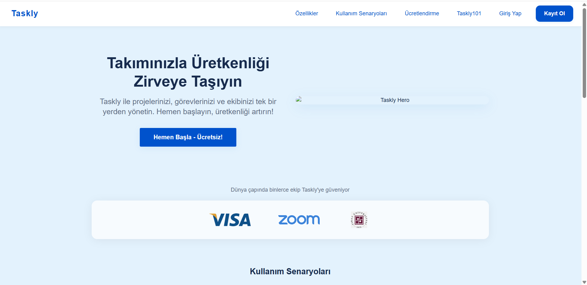
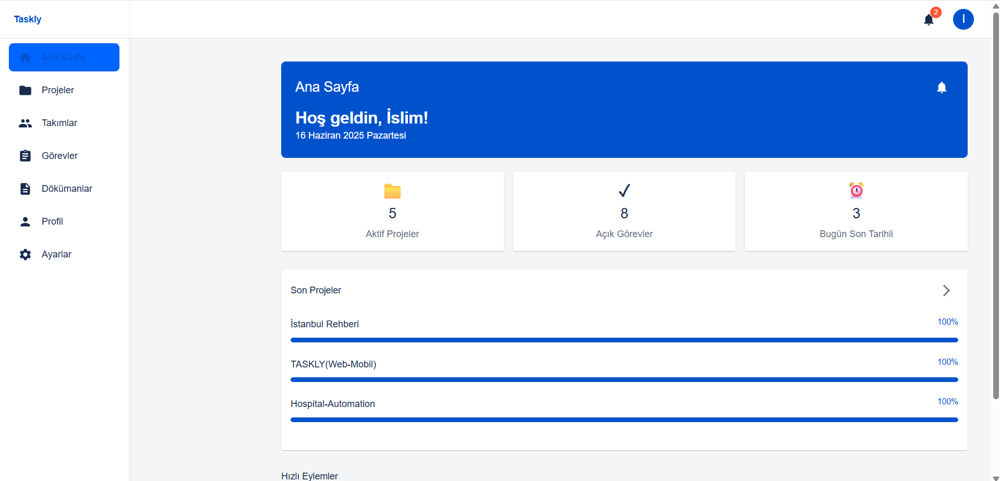
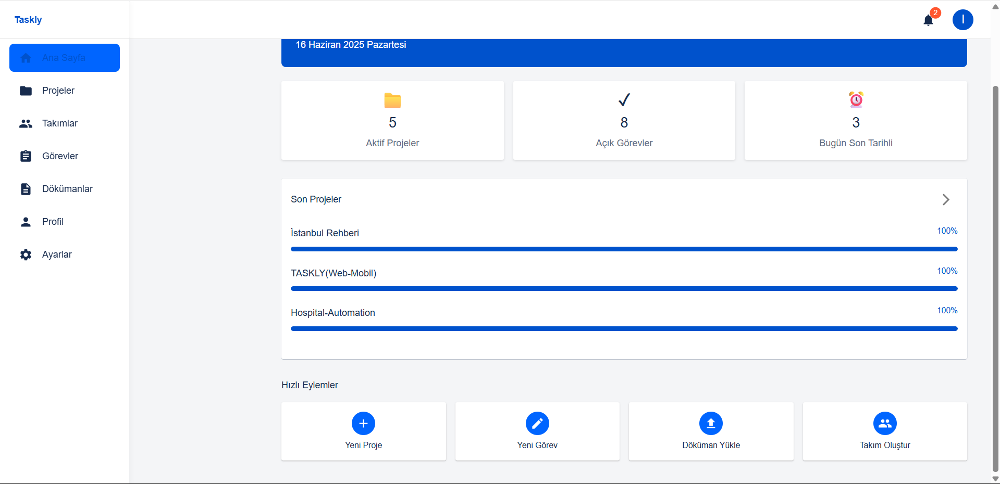
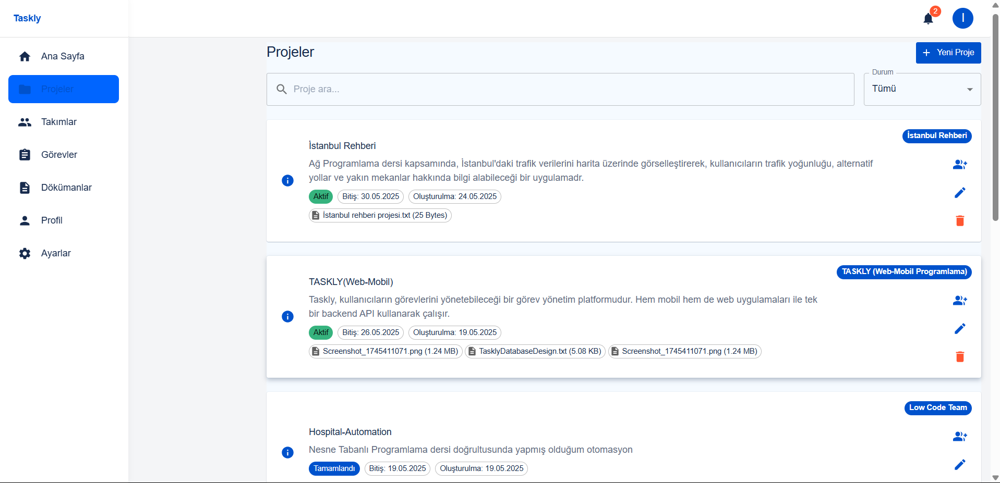
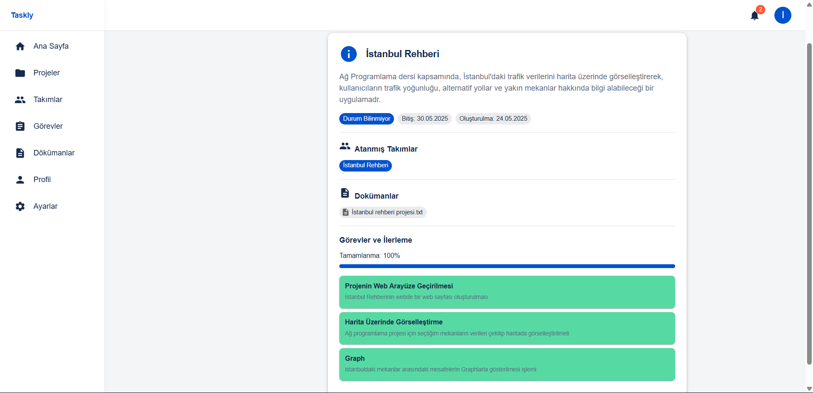
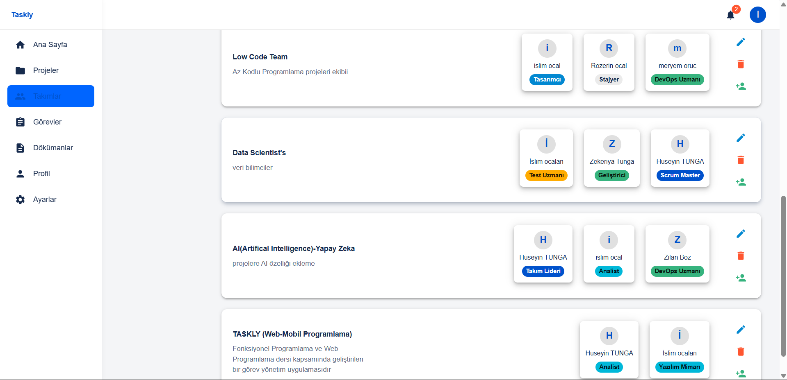
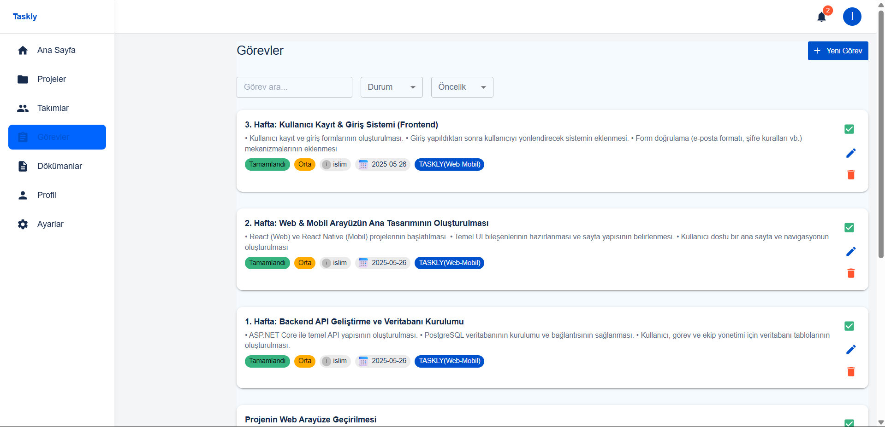
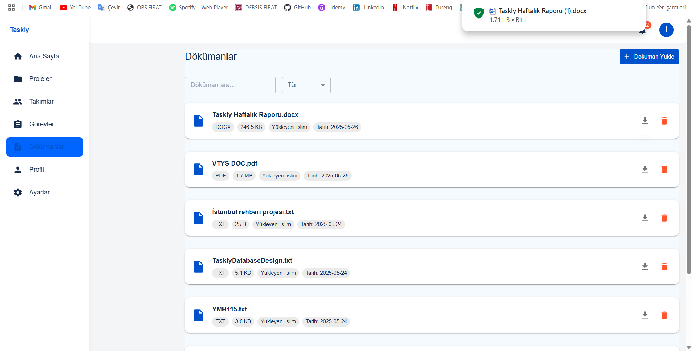
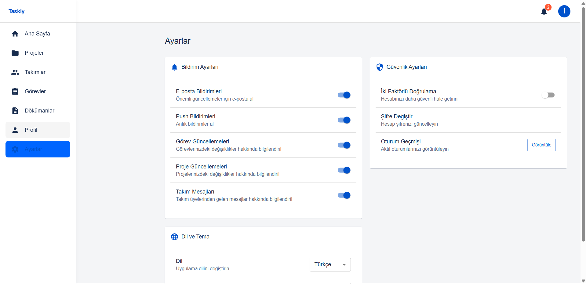
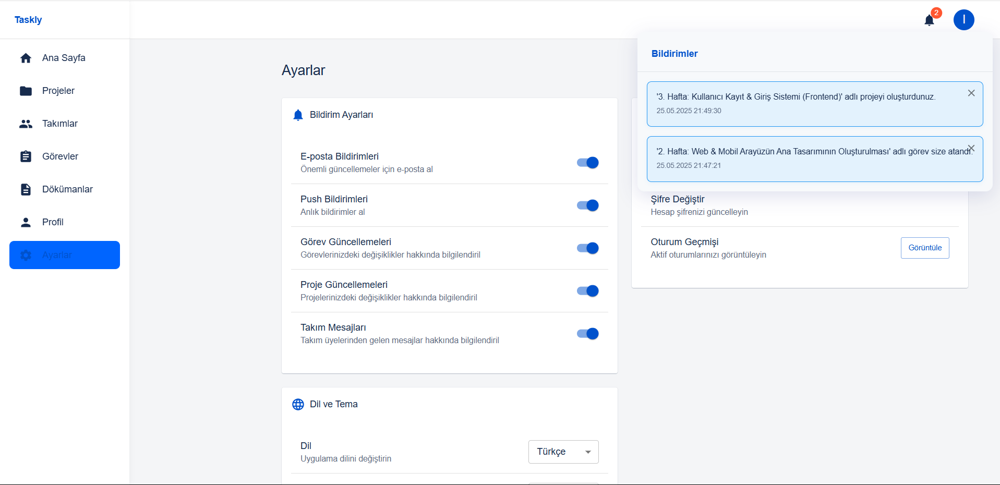

# Taskly – Görev & Proje Yönetimi (Web)

**Taskly**, bireysel kullanıcılar ve yazılım ekipleri için geliştirilmiş, sade ama güçlü bir **görev ve proje yönetimi** uygulamasıdır.  
Bu depo **web istemciyi (React)** içerir. (Mobil uygulama: React Native / Backend API: ASP.NET Core)

## 🎯 Amaç
- Proje ve görevlerinizi tek yerden planlamak, takip etmek ve tamamlamak
- Ekip içi iş birliğini hızlandırmak
- Basit, anlaşılır ve hızlı bir arayüz sunmak

## 🚀 Öne Çıkan Özellikler
- **Proje & Görev Hiyerarşisi:** Proje → Görev akışı, durum (aktif/tamamlandı), öncelik ve son tarih yönetimi
- **Atamalar:** Görevlere kullanıcı atama, sorumlu takibi
- **Filtreleme & Arama:** Durum/öncelik/etiket bazlı filtreler, hızlı arama
- **Bildirimler:** E-posta ve uygulama içi bildirim seçenekleri
- **Doküman Yönetimi:** Projelere dosya/doküman ekleme ve görüntüleme
- **Takım Yönetimi:** Ekipler oluşturma, rollerle (Owner/Admin/Member/Viewer) yetkilendirme
- **Aktivite Geçmişi:** Proje ve görevlerdeki değişikliklerin kaydı
- **Uyumlu Tasarım:** Web ve mobilde tutarlı arayüz, modern ve sezgisel deneyim

## 🧭 Sayfa Haritası (Web)
- **Landing (01):** Ürüne genel bakış, aksiyon çağrısı (Hemen Başla)
- **Dashboard (02–03):** Proje ve görev özetleri, metrikler ve kısa yollar
- **Projeler (04):** Proje listesi, durum/etiket/filtreler
- **Proje Detayı (05):** Açıklama, atanan ekip, dokümanlar ve ilerleme
- **Takımlar (06):** Ekip kartları, rol ve üyelik yönetimi
- **Görevler (07):** Görev listesi, durum/öncelik/son tarih ve atamalar
- **Dokümanlar (08):** Projeye bağlı dosya/doküman yönetimi
- **Ayarlar – Güvenlik (09):** Şifre/2FA, oturum geçmişi
- **Ayarlar – Bildirimler (10):** E-posta/push bildirim tercihleri

## 🛠️ Teknolojiler
- **Web (bu repo):** React  
- **Mobil:** React Native  
- **Backend API:** ASP.NET Core (C#), **JWT** kimlik doğrulama  
- **Veritabanı:** PostgreSQL  
- **Mimari:** RESTful API

> Not: Aşağıdaki bölümde bu sayfaların ekran görüntülerini bulabilirsiniz.

# 📸 Ekran Görüntüleri

## 1) Karşılama & Kontrol Paneli
| Ana Sayfa (Landing) | Kontrol Paneli – Genel Bakış |
|---|---|
|  |  |

## 2) Kontrol Paneli & Projeler
| Kontrol Paneli – Kısa Görünüm | Projeler Listesi |
|---|---|
|  |  |

## 3) Proje & Takımlar
| Proje Detayı | Takımlar |
|---|---|
|  |  |

## 4) Görevler & Dokümanlar
| Görevler | Dokümanlar |
|---|---|
|  |  |

## 5) Ayarlar
| Güvenlik | Bildirimler |
|---|---|
|  |  |
